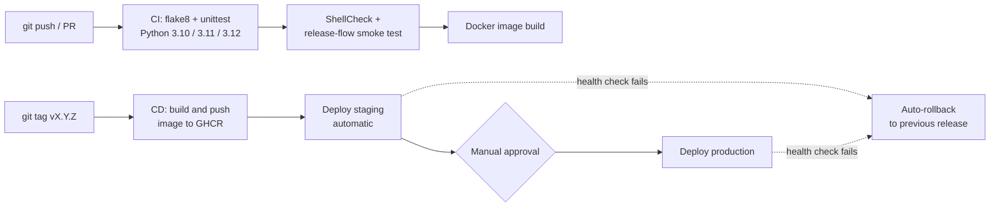

<div align="center">

# CI/CD Release Pipeline

**Automated build, test, release and deploy for a FastAPI service, with health checks and automatic rollback.**

[](https://github.com/shaikumar11/cicd-release-pipeline/actions/workflows/ci.yml)


</div>

---

## Overview

Shipping code safely means more than pushing to a server. This project automates the whole path from commit to production:

- **Every push** is linted, tested on three Python versions, shell-checked and exercised end to end.
- **Every version tag** builds a container image, deploys to **staging** automatically, then waits for a **manual approval** before **production**.
- **Every deploy** is verified against a `/health` endpoint. If the new release is unhealthy, the previous one is **restored automatically**.

## Pipeline



## Features

| Area | What it does |
|---|---|
| **Continuous Integration** | flake8 lint, unittest on a Python version matrix, ShellCheck on all scripts, Docker build, full release-flow smoke test |
| **Continuous Deployment** | Tag-triggered workflow with separate `staging` and `production` environments and an approval gate |
| **Release management** | `release.sh` calculates the next semantic version from git tags, updates `CHANGELOG.md`, and creates an annotated tag |
| **Safe deployments** | Versioned release directories, atomic symlink switch (no half-deployed state), retention of the newest 3 releases |
| **Health checks** | `healthcheck.sh` polls `/health` with retries before a release is declared live |
| **Automatic rollback** | A failed health check restores the previous release; `rollback.sh` does the same on demand |

## Demo

Real output from `./scripts/smoke_test.sh`. It deploys two good releases, then ships a deliberately broken one:

```text
[09:58:48] [staging] release v1.1.0 is live
[09:58:48] OK live=v1.1.0
[09:58:48] [staging] packaging release v1.2.0
[09:58:48] [staging] switching current -> v1.2.0
unhealthy after 15 attempts (last status: 503)
[09:59:05] [staging] health check FAILED for v1.2.0
[09:59:05] [staging] auto-rollback -> v1.1.0
healthy (attempt 2)
[09:59:08] OK live=v1.1.0          <-- bad release never served traffic
[09:59:08] [staging] rollback v1.1.0 -> v1.0.0
healthy (attempt 2)
[09:59:11] OK live=v1.0.0
[09:59:11] smoke test passed
```

## Quick start

Requires Python 3.10+, Bash and curl (use Git Bash or WSL on Windows).

```bash
git clone https://github.com/shaikumar11/cicd-release-pipeline.git
cd cicd-release-pipeline
pip install -r requirements.txt

make ci          # lint + unit tests + full release-flow smoke test
```

Try the deployment flow yourself:

```bash
./scripts/deploy.sh staging v1.0.0                          # first release
./scripts/deploy.sh staging v1.1.0                          # upgrade
./scripts/deploy.sh staging v1.2.0 --simulate-bad-release   # fails health check, auto-rollback
./scripts/rollback.sh staging                               # manual rollback
curl localhost:8101/version                                 # see which version is live
```

Staging listens on port `8101` and production on `8102` (override with `STAGING_PORT` and `PRODUCTION_PORT`).

## Cutting a release

```bash
./scripts/release.sh patch               # v0.1.0 -> v0.1.1, updates CHANGELOG.md, tags the commit
git push origin main --follow-tags       # triggers the CD workflow
```

To enable the approval gate, open **Settings > Environments > production** and add a required reviewer.

## Project structure

```text
.
├── app/                    FastAPI service (/health, /version)
├── tests/                  unittest suite
├── scripts/
│   ├── deploy.sh           versioned deploy, health check, auto-rollback
│   ├── rollback.sh         manual rollback to the previous release
│   ├── release.sh          semantic version bump, changelog, git tag
│   ├── healthcheck.sh      retrying HTTP health probe
│   ├── service.sh          start/stop the app for an environment
│   ├── smoke_test.sh       end-to-end proof of the whole release flow
│   └── common.sh           shared helpers
├── .github/workflows/
│   ├── ci.yml              runs on every push and pull request
│   └── cd.yml              runs on version tags: build, staging, production
├── Dockerfile
└── Makefile                make lint | test | smoke | ci
```

## How a deploy works

1. Copy the app into `deployments/<env>/releases/<version>/`.
2. Build a temporary symlink and rename it over `current`, which is an atomic switch.
3. Start the service and poll `/health`.
4. **Healthy:** release is live and old releases beyond the newest 3 are pruned.
5. **Unhealthy:** point `current` back at the previous release, restart it, verify, exit non-zero so the pipeline fails visibly.

## Design decisions

- **Symlink switching** keeps rollback instant, with no rebuild and no redeploy.
- **Local release directories as deploy targets** let the entire pipeline run for free on a GitHub runner. Replacing `service.sh` with `ssh`, `docker compose` or a cloud CLI call points the same flow at a real server.
- **A failure flag (`APP_FAIL_HEALTH`)** lets the pipeline prove its own rollback logic on every CI run instead of trusting it.
- **Plain Bash and GitHub Actions** keep the tooling transparent and dependency-free.

## Tech stack

Python, FastAPI, Uvicorn, Bash, GitHub Actions, Docker, GitHub Container Registry, flake8, ShellCheck, unittest, Make, Git.

## Roadmap

- [ ] Deploy to a real cloud VM over SSH
- [ ] Slack or email notification on failed deploys
- [ ] Canary release step before full production rollout
- [ ] Prometheus metrics endpoint and basic alerting

## Author

**Shaik Mohammed Umar** · [LinkedIn](https://linkedin.com/in/mohammed-umarshaik) · [Portfolio](https://mohammedumar.netlify.app) · [GitHub](https://github.com/shaikumar11)
